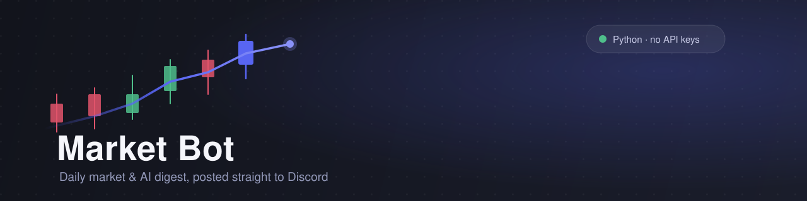

<p align="center">
  
</p>

<p align="center">
  
  
  
</p>

Posts a daily market + AI news digest to a Discord channel, weekdays at 4:30
PM. Python, standard library only — nothing to `pip install`.

## What it posts

Indexes, your watchlist, rates/commodities/crypto, and headlines — opened
with a plain-English summary written by rules, not AI:

> Stocks closed broadly lower on Monday, with the S&P 500 edging down 0.33%
> to 7,686. Across AI and big tech, 7 of 14 names advanced - Tesla rose
> 5.50%, while Amazon fell 2.50%.

## Setup

Requires [Python 3.11+](https://www.python.org/downloads/) — nothing else to install.

1. **Get the code**:
   ```bash
   git clone https://github.com/BobbyPoppy32/market-bot.git
   cd market-bot
   ```
2. **Create your own bot** — a bot token is tied to one Discord application,
   so you can't reuse someone else's. At
   [discord.com/developers/applications](https://discord.com/developers/applications) →
   *New Application* → name it → **Bot** tab → *Reset Token* → copy it.
3. **Invite it to your server** — same page, **OAuth2 → URL Generator** →
   check `bot` under Scopes, then `View Channels`, `Send Messages`,
   `Embed Links` under Bot Permissions. Open the generated URL and pick your
   server.
4. **Get the channel ID** — Discord: User Settings → Advanced → Developer
   Mode → right-click the channel → Copy Channel ID.
5. **Create a `.env` file** in the `market-bot` folder:
   ```
   DISCORD_BOT_TOKEN=the-token-from-step-2
   DISCORD_CHANNEL_ID=the-id-from-step-4
   ```
6. **Run it**:
   ```bash
   python market_bot.py --check   # verify credentials
   python market_bot.py           # post the digest
   ```

`.env` is gitignored — never commit it, and never share your token. If it
leaks, hit *Reset Token* in the Bot tab to invalidate it.

## Commands

| Command | Effect |
| --- | --- |
| `python market_bot.py` | Post the digest |
| `python market_bot.py --dry-run` | Print it, send nothing |
| `python market_bot.py --check` | Validate credentials only |

Only `market_bot.py` is run directly — files in `marketbot/` are modules it
imports.

## Running it daily

```powershell
.\setup-schedule.ps1 -Time "16:30" -NoMorning
```

Registers a Windows Scheduled Task. Test it now with
`Start-ScheduledTask -TaskName "MarketBot Daily Digest"`, remove it with
`.\setup-schedule.ps1 -Remove`. Output logs to `logs\market-bot.log`.

## Customising

| Change | Where |
| --- | --- |
| Tickers | `INDICES` / `MACRO` / `WATCHLIST` in `market_bot.py` |
| News sources | `MARKET_FEEDS` / `AI_FEEDS` in `marketbot/news.py` |
| Summary wording | `marketbot/summary.py` |
| Message layout | `build_message()` in `marketbot/formatting.py` |

## Notes

- Yahoo Finance and RSS feeds are public, undocumented endpoints — stable,
  but no uptime guarantee. A failing ticker or feed is skipped, not fatal.
- Discord caps messages at 2000 characters; long digests auto-split at
  section boundaries.
